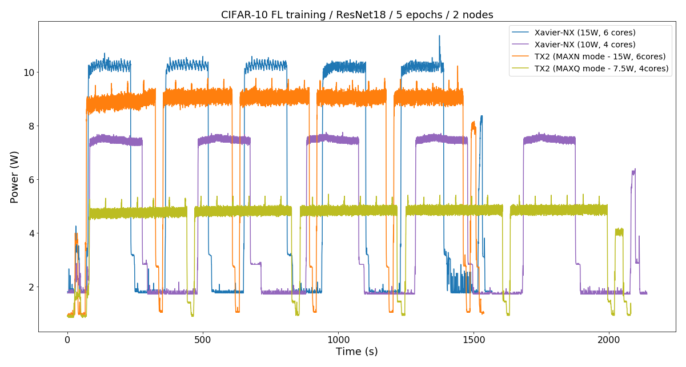
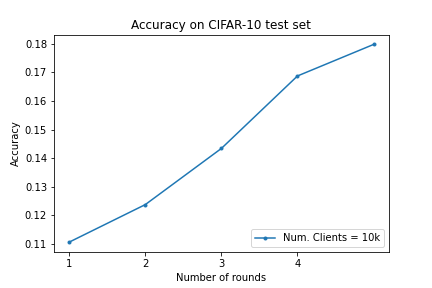
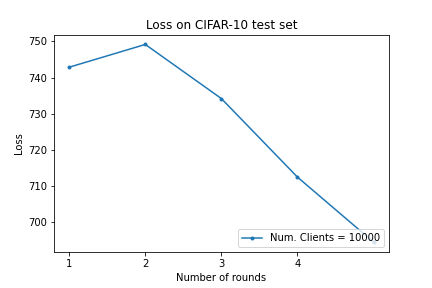

# MLSys'21 Additional Rebuttal Material (submission #170)

We provide supplementary material that wouldn't be possible to include in the format used in the rebuttal document. The content here provided supports the claims made in the rebuttal addressing the points raised by reviewers.

## Federated ResNet18 learning on Heterogenous Clients with Flower

Flower enables deploying FL workloads on edge devices. Achieving this with other frameworks that by design are limited to simulating these FL experiments, would require a substantial engineering effort for individual researchers. 

With Flower we can obtain metrics that wouldn't be possible to get from simulations alone. For instance, power consumption and accurate latency metrices at each node. 

The figure above shows two FL experiments using two NVIDIA-Jetson devices as clients. Both experiments train a ResNet18 on CIFAR-10 for 5 rounds. We run this experiment twice: first, using the high performance mode available on each device (see blue and oragne lines); and a lower power mode (purple and green lines). The power monitoring was done by running on a parallel process the `tegrastats` utility function available on these devices.

### High Power Consumption mode
+-------------------------+--------------------------------+---------------+
|         Device          | Train time per epoch (s/epoch) | Avg.(s/epoch) |
+-------------------------+--------------------------------+---------------+
| Xavier-NX (15W-6cores)  | [191, 170, 168, 169, 171]      |         173.6 |
| Jetson-TX2 (15W-6cores) | [274, 270, 271, 272, 270]      |         271.4 |
+-------------------------+--------------------------------+---------------+

### Low Power Consumption mode
+--------------------------+--------------------------------+---------------+
|          Device          | train time per epoch (s/epoch) | Avg.(s/epoch) |
+--------------------------+--------------------------------+---------------+
| Xavier-NX (10W-4cores)   | [210, 203, 197, 201, 204]      |           203 |
| Jetson-TX2 (7.5W-4cores) | [390, 380, 382, 377, 382]      |         382.2 |
+--------------------------+--------------------------------+---------------+

>Add Takeaways from the figure

## Federated Learning with 10k clients

As requested in the reviews, we further show Flower's scalability by training our network on the CIFAR10 dataset using **10 thousand** devices with **1 thousand** participating clients in each run. The Figures below show the accuracies and losses obtained after each trained round.

Each round consisted of one epoch and *FedAvg* was used to generate the results.  

